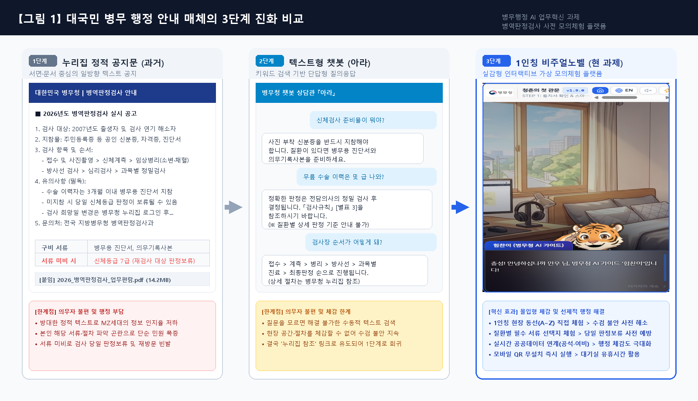

【붙임 1】

# AI 활용 업무혁신 아이디어(혁신과제) 제안서

| 과 제 명 | **공공데이터와 생성형 AI 기반의 『시나리오별 병역이행 사전 모의체험 플랫폼』 구축**<br>*- 1인칭 주인공 시점의 몰입형 모의체험 콘텐츠 「청춘의 첫 관문, 병역판정검사」 구현 -* |
| :--- | :--- |
| **제안 배경 및 필요성** | **□ 서면·문서 중심 단방향 안내 관행에 따른 MZ세대 정보 수용성 저하**<br>  ○ (정적 텍스트 공지 전달력 한계) 누리집 공지, PDF 안내문, 종이 통지서는 모바일 환경에 익숙한 MZ세대의 관심을 유도하지 못해 핵심 규정 및 지참서류 인지 실패 초래<br>  ○ (일회성 사이트 분산 구축 비효율) 정책별 단발성 웹페이지 분산 개발로 예산 중복 투자 발생 및 정책 확장을 뒷받침할 표준 프레임워크 부재<br>  ○ (사후 국민 체감도 분석 도구 부재) 단방향 배포 후 MZ세대 수검자들이 어느 단계에서 이해를 못 하고 이탈하는지 파악·개선할 관리 체계 전무<br><br>**□ MZ세대 눈높이 맞춤형 『병역이행 사전 모의체험 플랫폼』 구축**<br>  ○ (양방향·체감형 행정 서비스 전환) 단순 열람을 탈피하여 MZ세대가 직접 선택·판단하며 절차를 미리 경험하는 1인칭 양방향 체험 플랫폼 구현 필요성 증대<br>  ○ (비주얼 노벨 도입) 본인 이름 설정 및 캐릭터화 통한 몰입감 극대화로 수검자가 스토리를 직접 주도하며, 지루하고 딱딱한 행정 절차를 내가 직접 겪는 생생한 1인칭 모의체험으로 전환<br>    - *비주얼 노벨(Visual Novel): 화면 속 대화와 배경, 캐릭터 표정, 음성 안내에 상황별 선택지를 결합하여 이용자가 직접 선택하며 이야기를 풀어나가는 1인칭 대화형 콘텐츠*<br>  ○ (공공데이터·법령 기반 시나리오 구현) 시나리오 대본 내 최신 법령정보 및 공공데이터 API 연계, 관할 지방청 잔여석 조회·거주지 기준 여비 산출 등 실제 행정 정보 기반 실감형 사전 모의체험(시뮬레이션) 제공<br>  ○ (일 1회 시나리오 검증체계 도입) 시나리오 대본을 최신 공공데이터 및 법령정보와 자동 대조하여, 내용 불일치와 오류를 선제적으로 점검·보완함으로써 행정 안내의 최신성과 신뢰도 상시 확보<br>    - *(실제 대본 검증 예시)* 플랫폼 내 대본의 「여비 지급 안내(식비·교통비 단가)」 및 「검사규칙 조항」을 공공데이터포털 여비 단가 API 및 국가법령정보센터 최신 개정문과 일 1회 자동 비교·검증하여, 단가 변동이나 법조문 개정 시 별도의 수동 콘텐츠 업데이트(재개발) 없이도 항상 최신 공인 자료를 무중단 유지하고 행정 안내의 무결성 보장<br>  ○ (이용 데이터 기반 지속 개선) 사용자 시나리오 단계별 진행도와 이탈 데이터 모니터링 시스템 구축, 데이터 분석 바탕 문제 구간 대본 및 안내 방식 지속 보완·발전 체계 확립<br>  ○ (시나리오 확장을 통한 정책 홍보) 시나리오 추가로 병역 전 주기(입영·복무·예비군) 정책 정보를 맞춤형으로 전달·홍보할 수 있으며, 타 부처 확산 가능성이 높아 병무청의 선제적 구축을 통한 공공 디지털 행정 혁신 선도<br><br>**□ 첫 번째 시나리오 「병역판정검사」: 검사 전 과정(A~Z) 1인칭 모의체험**<br>  ○ (수검자 심리적 불안 해소) 검사장 도착부터 최종 판정까지 전 과정을 1인칭으로 직접 모의체험하여 막연한 두려움을 해소하고 능동적 참여 유도<br>  ○ (현장 접근성 강화) 병역판정검사 대기 시 스마트폰 QR코드나 모바일 웹 접속을 통해 별도 앱 설치 없이 다음 검사 순서와 유의사항 손쉽게 확인<br>  ○ (행정 민원 감축 및 편의 제고) 공공데이터 API 및 법령 기반으로 검사 준비물과 행정 전반의 핵심 정보를 시나리오화하여, 현장 행정 민원 감축 및 민원인 편의성과 행정 신뢰도 제고<br><br><br>*< 그림 1. 대국민 병무 행정 안내 매체의 3단계 진화 비교 (1단계: 누리집 정적 공지 ➔ 2단계: 텍스트 챗봇 문답 ➔ 3단계: 1인칭 비주얼노벨 모의체험) >* |
| **연구분야** | 병역판정검사 / 동원·소집 / 대국민 디지털 혁신 / 정보기획 |
| **소속기관** | 강원지방병무청 (※ 소속 지방청명으로 자율 수정 가능) |
| **대표직원** | 소속 : 병역판정검사과 / 직급·성명 : 주무관 O O O |
| **참여인원** | 소속 : 병역판정검사과 / 직급·성명 : 주무관 O O O 외 O명 |

---

### 과 제 개 요   및   추 진 내 용

| 항목 | 세부 내용 |
| :--- | :--- |
| **워크메이트 활용<br>(가점 5점)** | **□ [검사 실무 절차 질의] 업무편람 바탕의 현장감 있는 시나리오 작성**<br>  ○ **병역판정검사 실무 절차 및 업무편람 질의**<br>    - 워크메이트를 통해 병역판정검사 업무편람 및 검사규칙의 실제 진행 절차, 과목별 검사 동선, 신체등급 판정 기준 참고<br>  ○ **검사 실무 기준에 부합하는 시나리오 구성**<br>    - 현장 검사 동선(접수 ➔ 신체계측 ➔ 과목별 검사 ➔ 최종 판정)과 구비서류 지침을 충실히 반영하여 현실감 높은 모의체험 시나리오 구현<br><br>**□ [민원 분석] 병역판정검사 주요 민원 기반 상황별 선택지 설계**<br>  ○ **병역판정검사 관련 주요 민원 분석**<br>    - 워크메이트에 축적된 질의회신 및 주요 민원(과목별 병무용 진단서 구비 요건, 영상자료 지참 기준, 신분증 등 필수 준비물) 도출<br>  ○ **수검자 오해·실수 예방을 위한 시나리오 상황별 선택지 반영**<br>    - 도출된 주요 민원 사례를 시나리오 내 핵심 상황별 선택지로 구현하여, 의무자의 시행착오 및 단순 행정 민원 사전 예방 |
| **활용 모델** | **□ 최신 생성형 AI(언어·시각·코드) 및 오픈소스 기술 복합 활용**<br>  ○ **생성형 AI 언어·코드 모델 (Google Gemini)**: <br>    - **시나리오 분석 및 법령 대조**: 작성된 시나리오와 실제 병역 법령·검사규칙을 대조하여 절차적 오류 및 법적 정합성 사전 검증<br>    - **대화문 구성 및 문체 정제**: 딱딱한 행정 용어를 의무자 눈높이에 맞춘 직관적인 1인칭 대화형 문체로 정제<br>    - **웹 구조 설계 및 코드 생성**: HTML5, CSS3, JavaScript (ES6+ 표준) 기반의 무설치 초경량·고반응성 웹 구조 설계 및 PC·모바일(반응형 웹) 환경 모두 지원<br>  ○ **생성형 AI 시각 디자인 모델 (Google Flow)**: <br>    - **대본 맞춤형 캐릭터 시각화**: 시나리오 대본 흐름 및 상황별 대사에 부합하는 다양한 맞춤형 캐릭터와 표정 변화 구현<br>    - **검사장 실제 공간 배경 이미지**: 전국 지방청 표준 검사장 환경(로비, 탈의실, 신체계측실, 채혈실, X-ray실, 심리검사실, 중앙판정실 등)의 사실적 시각화<br>  ○ **오픈소스 기술 및 다국어·TTS 지원**: GitHub Actions(일 1회 데이터 무결성 자동 검증 스케줄러), Web Speech API(표준 음성) 연동 및 외국인·다문화 의무자를 위한 한/영 전환·맞춤 음성 안내 지원 (300여 개 음성 파일 생성 및 실시간 출력) |
| **구현 방법 및 핵심 기능** | **□ 모듈형 확장식 비주얼노벨 플랫폼 개발**<br>  ○ **모바일·PC 멀티 디바이스 지원 및 대국민 접근성 강화**<br>    - 모바일 및 PC 환경 완벽 지원을 통해 장소 제약 없는 반응형 웹 플랫폼 자체 구축 (HTML5, CSS3, JavaScript 기반)<br>    - 1인칭 대화창, 텍스트 타이핑 출력 연출, 음향 제어 및 대사 자동저장 기능 구현<br>  ○ **시나리오 모듈 분리형 확장 구조 확립**<br>    - 플랫폼 엔진과 시나리오 데이터 분리 설계로 프로그램 코드 수정 없는 신속·용이한 대본 수정 및 유지관리 편의성 확보<br>    - 시나리오 데이터 추가만으로 신규 정책 홍보 즉각 구현 가능, 병역판정검사를 시작으로 예비군훈련·사회복무 등 병무행정 전 주기 체계 구축 및 타 기관 정책으로 확장 가능<br>  ○ **실시간 공공데이터 연계 및 일 1회 자동 검증 체계**<br>    - 공공데이터포털(잔여석, 여비 기준) 및 국가법령정보(검사규칙, 병역법) Open API를 공식 근거로 시나리오 대본 생성<br>    - 일 1회 자동 배치 스케줄러(GitHub Actions) 구동으로 데이터 변동 감지 및 최신 행정 정보 무결성 상시 유지 (허위 정보 차단)<br>  ○ **데이터 기반 이용 통계 도구 제공**<br>    - 시나리오 단계별 사용자 체류 시간 및 중단 구간 데이터 통계 수집·분석<br>    - 분석된 통계 데이터를 바탕으로 취약 구간 대본과 선택지를 지속 보완·개선<br><br>**□ 플랫폼 첫 번째 시나리오 「병역판정검사」 모의체험 적용**<br>  ○ **검사 전 과정(A~Z) 1인칭 현장 동선 반영**<br>    - 검사장 접수부터 심리검사, 임상병리(소변·채혈), 방사선, 과목별 정밀검사, 판정, 나라사랑카드 발급까지 전 과정 1인칭 모의체험 구현<br>    - 낯선 검사 절차와 공간에 대한 심리적 두려움 사전 해소 및 몰입도 제고<br>  ○ **실감형 멀티미디어(배경·캐릭터·동영상) 및 다국어·음성 구현**<br>    - **검사장 표준 배경 9종**: 로비, 탈의실, 신체계측실, 임상병리실, 심리검사실, 진료실, 중앙판정실 등 실제 공간 9종 시각화<br>    - **등장인물 및 감정표현 13종**: 수검 의무자 감정표현 3종(긴장·기본·안도), 공식 안내 캐릭터 3종, 검사 분야별 전담관 7종(전담의사, 병리사, 심리사, 판정관 등) 그래픽 구축<br>    - **공간 이동 동영상 및 다국어·TTS**: 검사장 공간 이동 시 현장 안내 동영상 연출, 전 대사 한/영 다국어 지원 및 캐릭터별 음성(TTS) 출력 완비<br>  ○ **실제 법령 및 공공데이터 바탕 법적 정합성 확보**<br>    - 국가법령정보(검사규칙, 병역법) 및 공공데이터 Open API를 기반으로 실제 과목별 검사 진행 기준 및 신체등급(1~7급) 판정 요건 반영<br>    - 모든 대사 출력 시 관련 법령 조항 및 공공데이터 공인 출처(근거)를 실시간 표출하여 행정 공신력 확보 및 할루시네이션(허위 정보 생성) 차단<br>  ○ **주요 민원 사전 해소 및 서류 미비 판정보류 예방**<br>    - 주요 민원 사례(병무용 진단서 발급 기준, 영상자료 지참, 신분증 등 필수 준비물)를 시나리오 내 핵심 분기 선택지로 구성<br>    - 서류 미비로 인한 당일 판정보류 및 불필요한 재방문 차단, 단순·반복 민원 대폭 감축<br>  ○ **공공데이터 실시간 연계를 통한 맞춤형 행정 서비스 체감도 제고**<br>    - 공공데이터 Open API를 실시간 연계하여 실제 행정 데이터를 시나리오에 즉각 주입함으로써 수검 의무자의 현장 체감도 및 몰입도 극대화<br>    - 관할 지방청 선택에 따른 전국 지방청 실시간 잔여 공석 캘린더 조회 연동<br>    - 수검자 출발지 주소 기반 대중교통 거리 기준 병역이행 여비(교통비·식비) 자동 산출<br>    - 나라사랑카드 발급 혜택 비교 및 병역진로설계센터 상담 예약 원스톱 연계 |
| **데이터 활용** | **□ 공공데이터 연계·보안처리 및 일 1회 자동 검증 아키텍처**<br><br>```<br>┌────────────────────────────────────────────────────────────────────────────────────────────────┐<br>│                           [1. 외부 공인 데이터 소스 실시간 연계]                                │<br>│  • 공공데이터포털(data.go.kr) Open API (5종): 병무청 신체검사·공석·조직정보·나라사랑가게·모집병│<br>│  • 국가법령정보(open.law.go.kr) Open API (2종): 「신체검사 등 검사규칙」, 「여비지급 규정」        │<br>└──────────────────────────────────────────────┬─────────────────────────────────────────────────┘<br>                                               ▼<br>┌────────────────────────────────────────────────────────────────────────────────────────────────┐<br>│              [2. 일 1회(Daily) 자동 스케줄러 기반 데이터 수집 (GitHub Actions)]                │<br>│  • 일 1회(자정) 자동 배치 스케줄러 실행 ➔ 최신 API 데이터셋 및 법령 조문 응답값 자동 패치(Fetch)   │<br>└──────────────────────────────────────────────┬─────────────────────────────────────────────────┘<br>                                               ▼<br>┌────────────────────────────────────────────────────────────────────────────────────────────────┐<br>│               [3. 대본-데이터 무결성 대조 및 변동 감지 판정 엔진 (Diff Comparator)]              │<br>│  • 기존 시나리오 대본 내 법령 조문, 여비 단가, 판정 기준과 최신 API 응답값 1:1 해시(Hash) 대조 │<br>└───────────────────────┬───────────────────────────────────────────────┬────────────────────────┘<br>                        │ [변동 감지 시 세부 판단 분기]                 │<br>                        ▼                                               ▼<br>┌──────────────────────────────────────────────┐ ┌──────────────────────────────────────────────┐<br>│ [유형 A : 동적 파라미터 변동]                 │ │ [유형 B : 법령 조항 및 판정 지침 개정]       │<br>│ • 잔여석, 여비 지급 단가 등 수치 변동        │ │ • 검사규칙 조항, 구비서류 기준 개정         │<br>│ • 코드 수정 없이 즉시 무중단 자동 동기화     │ │ • 대본 내 출처 메타데이터 자동 매핑         │<br>│   (플랫폼 전 화면에 실시간 즉시 반영)        │ │ • 관리자 대시보드 경보 및 검토 알림 발송    │<br>└───────────────────────┬──────────────────────┘ └──────────────────────┬──────────────────────┘<br>                        └───────────────────────┬───────────────────────┘<br>                                                ▼<br>┌────────────────────────────────────────────────────────────────────────────────────────────────┐<br>│                 [4. 대사별 공인 근거 1:1 결합 메타데이터 및 화면 표출 시스템]                   │<br>│  • 모든 대사마다 법조문 및 API 출처 결합 ➔ 수검자 화면에 '공인 근거 배지' 상시 노출           │<br>│  • 최신 행정 정보 유지 및 할루시네이션(Hallucination) 차단 / 구형 데이터 방치 문제 해소        │<br>└────────────────────────────────────────────────────────────────────────────────────────────────┘<br>```<br><br>**1) 실시간 연계 공공데이터 및 법령정보 세부 명세 (공식 Open API 7종)**<br>  ○ **공공데이터포털(data.go.kr) Open API (5종)**<br>    - ① **병무청_병역판정 신체검사 정보 Open API**: 수검 대상자 유의사항, 검사 과목 및 일자별 진행 절차 실시간 연계<br>    - ② **병무청_병역판정검사 일자 및 공석 현황 Open API**: 전국 14개 지방병무청 일자별 실시간 잔여 공석 조회 및 희망일 변경 연동<br>    - ③ **병무청_지방병무(지)청 조직 및 연락처 Open API**: 관할 지방병무청 병역판정검사과 직통 유선 연락처 및 청사 교통편 매칭 안내<br>    - ④ **병무청_나라사랑가게 가맹점 및 우대혜택 Open API**: 전국 검사장 인근 음식점·카페 등 수검자 할인 혜택 데이터 연계<br>    - ⑤ **병무청_모집분야별 지원자격 및 실시간 군지원 접수현황 Open API**: 신체등급·전공 연계 맞춤 특기병 추천 및 실시간 지원 경쟁률 연동<br>  ○ **국가법령정보(open.law.go.kr) Open API (2종)**<br>    - ⑥ **「병역판정 신체검사 등 검사규칙」(국방부령) Open API**: 과목별 질환 평가기준 및 [별표 1~3] 신체등급(1~7급) 판정 기준 대조<br>    - ⑦ **「병역의무자 여비지급 규정」(병무청 훈령) Open API**: 출발지 주소 기반 대중교통 거리 기준 여비(교통비·식비) 자동 산출 연동<br><br>**2) 일 1회 자동 대사-데이터 정합성 검증 체계**<br>  ○ **자동 스케줄러 데이터 수집**: 일 1회(자정) 자동 스케줄러(GitHub Actions)가 Open API 최신 응답값 및 법령 개정 사항 자동 수집<br>  ○ **변동 사항 판정 및 동기화**: 잔여석·여비 등 수치 변동은 실시간 자동 동기화, 법령 개정 시 대사 내 근거 메타데이터 자동 갱신 및 관리자 알림 발송<br>  ○ **행정 정보 신뢰도 보장**: 대사마다 공인 출처 배지를 상시 표출하여 항상 최신 행정 정보를 유지하고 할루시네이션 차단<br><br>**3) 공공데이터 연계 보안 및 개인정보 보호 조치**<br>  ○ **개인정보 미수집 원칙(Zero-PII)**: 주민등록번호 등 민감정보 일체 미수집, 가상 입력 데이터는 세션 종료 시 브라우저에서 즉시 파기 (서버 미저장)<br>  ○ **API 보안 및 키(Key) 은닉**: API 호출 인증키를 사용자 화면에 노출하지 않고 백엔드 프록시로 은닉, 전 구간 HTTPS 암호화 통신 적용<br>  ○ **접속 로그 비식별화 및 규정 준수**: 이용 통계 분석 시 IP 하위 대역 마스킹 처리 및 비식별 세션 관리, 공공기관 정보보안 기본지침 준수 |
| **세부 개선 내용** | **[현 행 (AS-IS)]**<br>□ 특정 시점의 정적 데이터 의존 및 배포 후 방치되는 일회성 콘텐츠<br>  ○ 과거 데이터 스냅샷에 의존하여 법령 개정 시 불일치 발생 및 할루시네이션 위험 상존<br>  ○ 국민들이 어느 단계에서 이해를 못 하고 이탈하는지 파악할 도구가 없어 사후 보완 불가<br>  ○ 검사장 대기실에서 스마트폰 게임 등으로 시간을 무의미하게 소모<br><br>----------------------------------------------------<br><br>**[개 선 (TO-BE)]**<br>□ 일 1회 자동 검증 및 단계별 중단율 피드백 기반 자가진화형 플랫폼<br>  ○ 일 1회 스케줄러로 공공데이터·법령을 자동 검증하여 항상 최신 행정 정보 유지 (할루시네이션 차단)<br>  ○ 단계별 이용 중단율 관제 도구를 통해 취약 구간 대본을 지속 보완하여 계속 발전하는 콘텐츠 구현<br>  ○ PC·모바일 완벽 지원 및 현장 대기실 QR코드 연계로 수검자 즉시 열람 및 가족·친구 정보 공유 지원<br>  ○ 1화(신검) 실증을 시작으로 2화(예비군), 3화(사회복무)로 이어지는 모듈형 시리즈 콘텐츠 라인업 완성 |
| **기대효과 및<br>향후 발전방향** | **□ 업무 효율화 및 행정력 절감 측면 (행정 내부)**<br>  ○ **반복·단순 문의 전화 획기적 감축**: 일정 변경 방법, 준비물 등 주요 민원 질의에 대한 사전 자기해결을 유도하여 일선 병역판정과의 민원 응대 부담 대폭 경감 및 정밀 검사·판정 본연의 업무 집중도 극대화<br>  ○ **서류 미비로 인한 당일 판정보류 및 불필요한 재방문 예방**: 질환별 필수 소명서류(진단서, 영상자료 등) 사전 점검표 제공을 통해 재검에 소요되는 의무자의 교통비 및 불필요한 행정력 낭비 방지<br>  ○ **단일 표준 엔진 재활용 통한 시스템 구축 예산 획기적 절감**: 신규 정책마다 개별 웹페이지를 중복 개발하던 관행을 탈피하여, 단일 플랫폼에 시나리오만 탑재하는 방식으로 국가 정보화 예산 대폭 절약<br><br>**□ 대국민 서비스 체감도 및 권익 향상 측면 (사회적 가치 창출)**<br>  ○ **단계별 이용 분석 기반 상시 자가진화하는 고품질 행정 서비스**: 중단율 관제 도구와 일 1회 자동 검증 체계를 통해 의무자 눈높이에 맞춰 지속 보완·발전하는 공공 서비스 구현<br>  ○ **현장 유휴 대기시간 유익한 정책 골든타임 전환**: 검사장 대기실 QR코드를 통해 현장에서 검사 순서와 기준을 사전 숙지하고, 모바일 연계를 통해 부모·친구와 신뢰할 수 있는 정보를 투명하게 공유<br>  ○ **의무자 눈높이 공감 행정 구현 통한 병무행정 신뢰도 제고**: 1인칭 가상 모의체험으로 생애 첫 신체검사에 대한 막연한 두려움을 해소하고 국민이 체감하는 따뜻하고 신뢰받는 병역판정검사 구현<br><br>**□ 향후 발전 방향 및 플랫폼 확장성 (Future Scalability)**<br>  ○ **[1단계: 병무청 병역 전 주기 시리즈 완비]**<br>    - 『제1화 : 병역판정검사(청춘의 첫 관문)』 ➔ 『제2화 : 예비군 훈련』 ➔ 『제3화 : 사회복무생활』 순차 릴리즈<br>  ○ **[2단계: 범정부 K-Gov 정책 모의체험 표준 엔진 확산]**<br>    - 국세청(생애 첫 연말정산), 고용부(실업급여), 복지부(맞춤 복지혜택) 등 범정부 표준 플랫폼으로 보급<br>  ○ **[3단계: 비개발 실무자용 표준 저작 도구 배포]**<br>    - 타 공공기관 실무자가 서식 표만 작성하면 즉시 사전체험 웹 서비스가 완성되는 범정부 표준 행정 도구 오픈소스화<br><br>*< 그림 6. 병역 전 주기 모듈형 확장 및 범정부 정책 모의체험 표준 엔진 확산 로드맵 >* |
